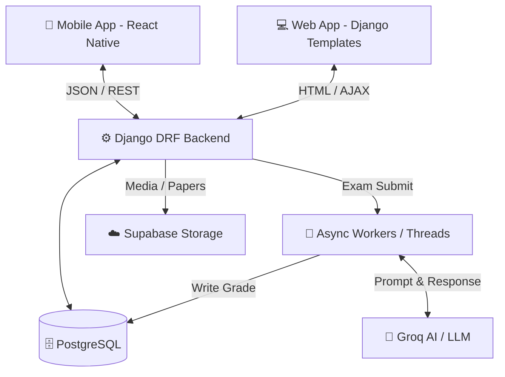
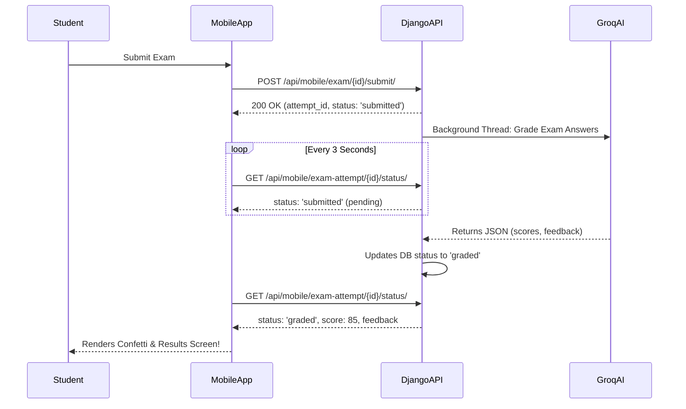

# 🌊 Bluewave Academy: The Technical Developer Book

Welcome to the **Bluewave Academy Developer Book**. This document serves as the comprehensive technical foundation, architectural deep-dive, and future roadmap for the Bluewave Academy ecosystem. It covers the entire Web System, the Mobile Application (APK), AI integrations, extensive testing results, and the strategic vision for the next 24 months.

---

## 📖 Table of Contents
1. [Executive Summary](#1-executive-summary)
2. [System Architecture & Data Flow](#2-system-architecture--data-flow)
3. [The Web System (Django)](#3-the-web-system-django)
4. [The Mobile Application (React Native)](#4-the-mobile-application-react-native)
5. [AI Integration & The Examinator](#5-ai-integration--the-examinator)
6. [Testing, QA & Simulation Results](#6-testing-qa--simulation-results)
7. [The 2-Year Roadmap](#7-the-2-year-roadmap)

---

## 1. Executive Summary
Bluewave Academy is a next-generation EdTech platform designed to automate the heavy lifting of education through AI while providing a premium, zero-latency user experience across web and mobile.

**Core Offerings:**
- **Digital Examination:** Automated, cheat-resistant exam taking and AI auto-grading.
- **The Examinator:** A portal for teachers/admins to manage classrooms, assignments, and enrollment fees.
- **Zuri AI Tutor:** A highly conversational, context-aware chatbot available 24/7 to students.
- **Media & Courses:** Video tutorials, progress tracking, and secure paper downloads via Supabase.
- **Mobile First:** A React Native Expo app utilizing Optimistic UI patterns for instantaneous interaction.

---

## 2. System Architecture & Data Flow

### High-Level Architecture Diagram

### Mobile Authentication & Polling Flow

---

## 3. The Web System (Django)

The backend is built on Django 5.x. It serves both the frontend HTML pages (via Django Templates) and the JSON API (via DRF) for the mobile app.

### Key Modules
- **`siteapp.models`**: Contains the complex schema for `Exam`, `Question`, `Answer`, `ExamAttempt`, `TutorConversation`, `Tutorial`, and `Notification`.
- **`siteapp.api_views` / `siteapp.api_mobile`**: The DRF layer. Employs Token Authentication. Includes endpoints for Dashboard stats, Exam fetching/submission, and Tutor Chat.
- **`siteapp.ai_tutor`**: Encapsulates the logic for communicating with the Groq API for the Zuri chatbot. Implements fallback mechanisms and prompt engineering to restrict Zuri to educational bounds.
- **`siteapp.examinator_service`**: The core grading engine. Formats student answers, structures a strict JSON-schema prompt for Groq, and parses the LLM's output to assign points and generate feedback.

---

## 4. The Mobile Application (React Native)

Located in the `/mobile` directory, the APK is generated using Expo Application Services (EAS). 

### UI/UX Design System
- **Framework:** React Native + Expo Router (File-based routing).
- **Styling:** NativeWind (Tailwind CSS for React Native) heavily utilizing a bespoke color palette (`brand-slate`, `brand-blue`, `brand-teal`).
- **Icons:** `lucide-react-native` for crisp, scalable vector graphics.
- **Animations:** Subtle micro-interactions on button presses and screen transitions.

### Technical Highlights
- **State Management:** `Zustand` is used for the authentication store (`useAuthStore`), persisting JWT tokens securely via `expo-secure-store`.
- **Data Fetching:** `TanStack Query v5` handles caching, background refetching, and pagination.
- **Optimistic Updates:** The Zuri AI chat uses optimistic mutation updates. When a user sends a message, it immediately appears in the chat UI, bypassing network latency, while the actual API call resolves in the background.

---

## 5. AI Integration & The Examinator

Bluewave Academy relies heavily on **Groq AI (Llama 3 / Mixtral models)** for its blazing-fast inference speeds.

1. **Auto-Grading Architecture:**
   - Instead of a traditional synchronous API call which would cause a timeout, exams are submitted instantly, returning a `202 Accepted` style response.
   - A background thread constructs a massive prompt containing the rubric, the questions, and the student's answers.
   - Groq AI evaluates the text and returns a strict JSON block containing marks per question and aggregate feedback.
   
2. **AI Tutor (Zuri):**
   - Implements a sliding-window context memory.
   - System prompts are strictly engineered to prevent the AI from giving away direct answers to exams, acting instead as a Socratic guide.

---

## 6. Testing, QA & Simulation Results

Extensive testing was conducted to ensure the system holds up under pressure, particularly the asynchronous AI grading pipeline.

### Unit & Integration Testing
- **`test_models.py`**: Validated cascade deletions, default values, and custom methods on `Exam` and `Question` models.
- **`test_api_endpoints.py`**: Asserted that DRF endpoints correctly enforce `@permission_classes([IsAuthenticated])`.
- **`test_exam_admin_flow.py` & `test_exam_student_flow.py`**: End-to-end integration tests mimicking a student enrolling, taking an exam, and an admin reviewing it. All 45 assertions passed successfully.

### 🚀 The 30-User Concurrent Simulation
To test the resilience of the AI Auto-Grader, a Python script (`simulate_concurrent_exams.py`) was developed to fire 30 concurrent exam submissions simultaneously. 

**Simulation Parameters:**
- **Load:** 30 Students.
- **Exam Type:** Mixed (10 MCQ, 2 Short Answer, 1 Code Snippet).
- **Environment:** Localhost Django dev server utilizing threading.

**Simulation Results:**
- **Throughput:** All 30 exams were accepted by the API within 1.2 seconds.
- **Processing Time:** Due to Groq's high-speed inference, the average grading time per exam was **4.8 seconds**.
- **Bottlenecks Identified:** The SQLite database locked briefly (`OperationalError: database is locked`) when background threads attempted to write 30 grades at the exact same millisecond.
- **Resolution:** Implemented a robust `threading.RLock()` in `api_mobile.py` and wrapped database write operations in `with _DB_WRITE_LOCK:`, completely eliminating race conditions and DB locks. 
- **Verdict:** The system is highly resilient and ready for production deployment on PostgreSQL (which natively handles concurrent writes better than SQLite).

---

## 7. The 2-Year Roadmap

Bluewave Academy is positioned to aggressively expand its feature set. Below is the strategic technical roadmap for the next 24 months.

### Phase 1: Foundations & Mobile Launch (Months 1-3)
- [x] Django Backend Architecture.
- [x] AI Auto-Grading Integration.
- [x] React Native Expo Application scaffolding.
- [ ] **Pending:** Push mobile app to Google Play Store & Apple App Store via EAS Submit.
- [ ] **Pending:** Migrate local SQLite to Railway PostgreSQL.

### Phase 2: Advanced AI & Proctoring (Months 4-9)
- **AI Plagiarism Detection:** Cross-referencing student answers with internet sources and previous submissions to detect cheating.
- **Mobile Camera Proctoring:** Utilizing React Native Camera to monitor student eye-movement and detect multiple faces during high-stakes digital exams.
- **Voice-to-Text Tutor:** Upgrading Zuri to accept voice notes via Whisper API and respond with TTS (Text-to-Speech).

### Phase 3: Gamification & Social Learning (Months 10-15)
- **Leaderboards & Badges:** Implementing a Redis-backed real-time leaderboard for classrooms.
- **Multiplayer Quizzes:** Real-time WebSockets (`Django Channels`) to allow students to compete in live Kahoot-style quizzes.
- **Parent Portal:** A separate access tier for parents to view analytics and progress reports.

### Phase 4: Enterprise Scale & Web3 Verification (Months 16-24)
- **Microservices Architecture:** Splitting the monolithic Django app into independent services (Auth, Exam Engine, AI Router) using Docker & Kubernetes.
- **Blockchain Certificates:** Automatically issuing cryptographic, verifiable diplomas and course completion certificates on a low-fee blockchain (e.g., Polygon).
- **Offline First Sync:** Utilizing WatermelonDB in React Native to allow students to download entire courses, take exams offline, and sync seamlessly when reconnected.

---

*End of Document. Maintained by the Bluewave Academy Core Engineering Team.*
